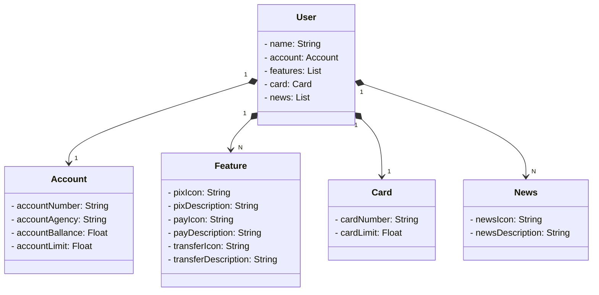

# Decola Tech Avanade 2025 - DIO
Java RESTful API criada para o Decola Tech Avanade 2025 - DIO

## Diagrama de Classes

```mermaid
classDiagram
    class User {
        - name: String
        - account: Account
        - features: List<Feature>
        - card: Card
        - news: List<News>
    }

    class Account {
        - accountNumber: String
        - accountAgency: String
        - accountBallance: Float
        - accountLimit: Float
    }

    class Feature {
        - pixIcon: String
        - pixDescription: String
        - payIcon: String
        - payDescription: String
        - transferIcon: String
        - transferDescription: String
    }

    class Card {
        - cardNumber: String
        - cardLimit: Float
    }

    class News {
        - newsIcon: String
        - newsDescription: String
    }

    User "1" *--> "1" Account
    User "1" *--> "N" Feature
    User "1" *--> "1" Card
    User "1" *--> "N" News
```
